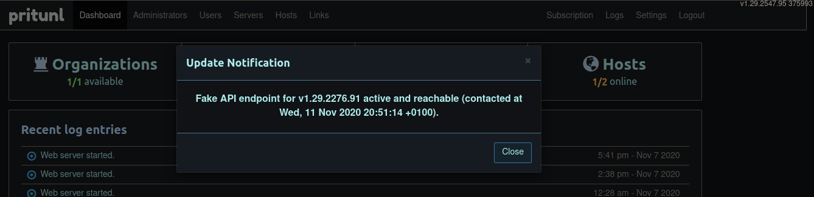
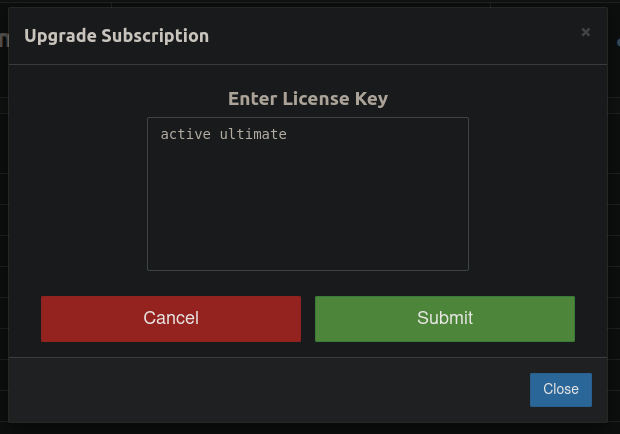
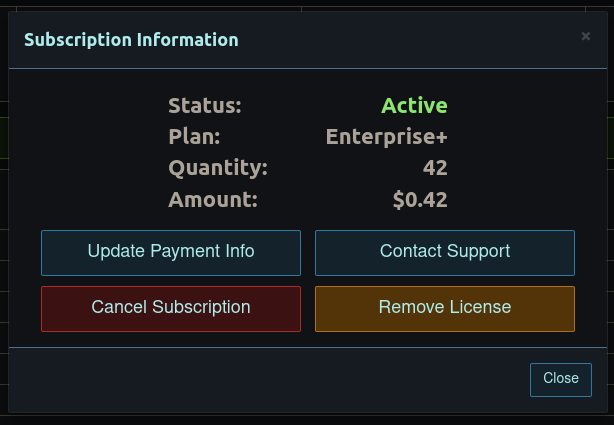

# What is this? #
This neat script provides a little fake API to unlock all premium/enterprise/enterprise+ (here called ultimate) features of your own Pritunl VPN server. If Pritunl wouldn't be mostly free already, you could call this a crack. An Open Source crack.

## How to setup (server) ##
Take a look into the `server` folder: You _could_ use the Pritunl source there (or just download this specific version from their GitHub repo) to compile a guaranteed compatible version for this API or just download any other version of the Pritunl server and try your luck.
Then you'll need to execute the `setup.py` script (preferable as `root`, as it needs to modify the Pritunl files directly).
After that log in into the dashboard - there should be a "Update Notification":

Now try to enter any serial key for your subscription and just follow the hints/notes if you enter an invalid command:

A valid command would be `bad premium` or `active ultimate`:

If everything worked, your subscription should now look like this:

Make sure to support the developers by buying the choosen subscription for your enterprise or company!

## How to setup (api) (optional) ##
This is _optional_. You can simply use the default instance of this API (host is noted inside the `setup.py` script) and profit from "automatic" updates.

Just transfer the `www` files inside a public accessible root-folder on your _dedicated_ Apache webserver (really everthing with PHP support works). Also make sure your instance has a valid SSL-certificate (Let's encrypt is enough), otherwise it may won't work.
An example Apache install process can be found [here](docs/apache/install.md). If you want to test your instance, just open the public accessible URI in your browser and append `/notification` to it - if you see some JSON with the text, then everything worked!

### Nett2Know ###
* This modification will also block any communication to the Pritunl servers - so no calling home :)
* The `ultimate` mode is still a little bit buggy. This is caused by some hacky workarounds to get all features displayed (the server is already unlocked). Caused by this workaround some items are maybe shown instead of being hidden. If you find such thing - just ping me about it.
* SSO will not work with this api version! As Pritunls own authentication servers handle the whole SSO stuff, track instance ids and verify users I won't implement this part for privacy concerns (and also this would need to be securly implemented and need a database).
* This api has also its own docker image. Take a look into the `docker` folder and enjoy!

Have fun with your new premium/enterprise/ultimate Pritunl instance!
